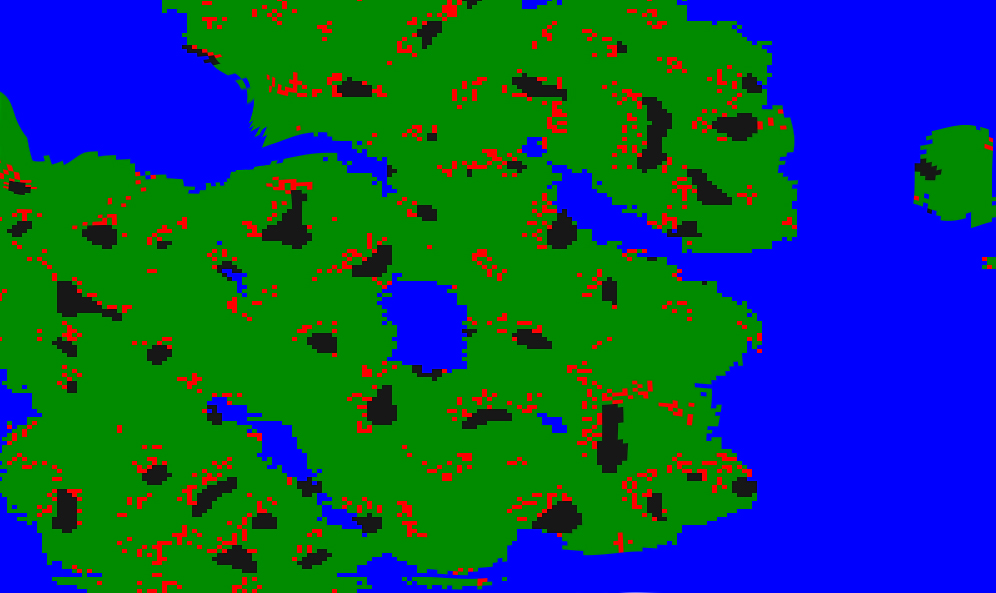

====================
VAIS Design
====================

Last updated 03-April-2015
VAIS Dev version 0.0.1

This document is a scratch pad area for design notes during the development of VAIS - Virtual AI Simulator

.. contents::


Design Overview 
---------------


As areas are completed, the contents will be copied to a users manual

*tags for progress are*

[unresolved]  = not sure how to do this

[in progress] = work may have started but early stages

[testing]     = key parts developed, testing results

[completed]   = tests passed and contents copied to users manual / ext paper


Key Concepts
``````````````

Build a series of randomly generated worlds

Define a series of randomly generated agents (NPC's / players)

Run multiple simulations of agents in world with different parameters to determine best outcome


================================
World (environment)
================================

Grounds (visual world)
--------------------------
The planet.py program generates a random world and populates it with 
animals and plant life.

Example below:




Materials
--------------
You can harvest materials such as wood, reeds, iron, stone.

drop rates are linked to the type of environment


Structures (buildings)
------------------------------
You can build on any thing


Building types include
Walls
Houses
Bridges

Each building has a cost

Materials can be collected for building things. Everything has a breakdown cost or least it can optionally be specified. 


================================
NPC’s (agents)
================================

Core Features
----------------------------
Name and description

Stats = how strong are they
Talents = what can they do


Stats (STA, INT, STR, Health)
----------------------------
Basic stats are set at startup but can be modified with training


Races and Classes
----------------------------
Use the traditional Moria like classes and races along with a mix of new ones and silly ones (modern IT person), (domestic cat)

When rolling the races and classes choice will determine an NPC’s stats and skills and strategies - you can modify any of these your self either via console or with training in game


Objects (Gold, armour, food, turnips)
----------------------------
Objects are things you carry in your pack or wear or wield
They have attributes like % CRIT increase when wielded as weapon

Objects can be found in dungeons and dropped from NPC’s or bought from shop


Skills (spells, shouts, kicks)
----------------------------
A spell is ANY special shot that a player or NPC can do. Different classes have some spells by default, but with gold and time ANYONE can train in most of the spells (unless trainable=false), though it will be harder and the spell will have lower impact


Strategies
----------------------------
The strategies an agent has tells the software how the agent acts. This is like the goals / plans of AIKIF so make it meld nicely.

GOAL = reach destination (x,y) or kill NPC(n) or obtain Object(n)

The AI then moves in that direction and if it meets someone it can [Fight, Run, Talk]

During a fight., the bulk of the strategies tell the AI how to use its Skills
IF health < 20% , run
IF enemy attacks, THEN block
IF enemy blocks THEN rest / charge / cast long shot?
Attack with Skill [x] while not on cooldown
Attack with Skill [x] if night
Attack with Skill [x] if wielding object [n]

This needs to be handled by the tree agent interactions.


Group Strategies
----------------------------
When an NPC is part of a group, then group strategies take over (the ratio is up to you - is any one person completely expendable? If true gives better strategies but reduces loyalty and promotes distrust

Group strategies involve sneaking up to big NPC’s and attacking from different angles at the same time (NPC can only block in one direction)


Messages
----------------------------
There are console messages for all things that happen (look E , wield turnip, attack E) and specifically there is a message describing what the NPC is doing that has a CHANCE to indicate what his next move is.
relaxing - NPC is relaxed, 90% chance they will do nothing
glaring - NPC is angry 50% chance it will attack

Also depending the XP range of you an NPC you can BOTH estimate if the NPC is going to attack or block.
Some moves are always visible , eg casting a fireball - you have better run or block or get the full damage.
Other moves have a chance and the message may be vague or specific
Vague - NPC hedges forward (attack), NPC moves back a bit (defend)

The vague moves MAY be wrong and wont give you the level of attack they do - eg if it was a short little attack you could have ignored it and continued your attack

Specific - gives accurate info on what level spell attack will occur - this allows you (or NPC) to activate appropriate action

When NPCs are playing, there is an element of randomness and brainfade meaning they wont alway do the precise best moves (this can be calibrated by mode - easy, med, hard, terminator)

See recursive breakdown of objects.  This will be handled in the same way. 
E.g.
Chance. Attack = 34

Attack . breakdown (time of day.  Am25. Pm=35%)


Relationships
----------------------------
You automatically have a relationship with every NPC you see or sees you (as well as all quest givers). This is like reputation and combined with charisma tells the game whether they talk to give, give you stuff, fight with you in a group or kill you

-10 (hell bent on killing you) -> netrual -> Loves you +10


================================
Running the game (simulation)
================================

Wield

Move

Sneak

Sprint

Fights

Talk

=====================================
Playing the game (user interaction)
=====================================

Start world

Training

Scoring

Quests


