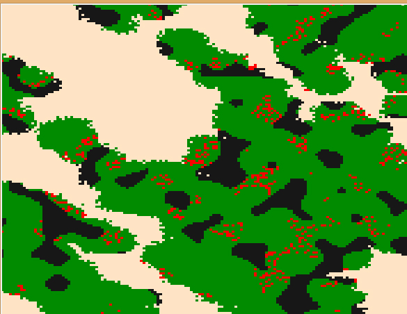

====================
VAIS Design
====================

Last updated 31-March-2015
VAIS Dev version 0.0.1

This document is a scratch pad area for design notes during the development of VAIS - Virtual AI Simulator

.. contents::


Design Overview 
---------------


As areas are completed, the contents will be copied to a users manual

*tags for progress are*

[unresolved]  = not sure how to do this

[in progress] = work may have started but early stages

[testing]     = key parts developed, testing results

[completed]   = tests passed and contents copied to users manual / ext paper


Key Concepts
``````````````

Build a series of randomly generated worlds

Define a series of randomly generated agents (NPC's / players)

Run multiple simulations of agents in world with different parameters to determine best outcome


================================
World (environment)
================================

Grounds (visual world)
--------------------------
The planet.py program generates a random world and populates it with 
animals and plant life.

Example below:




Materials

Structures (buildings)

================================
NPC’s (agents)
================================

Core Features

Starting with SIMPLE agents

Stats (STA, INT, STR, Health)

Races and Classes

Objects (Gold, armour, food, turnips)

Skills (spells, shouts, kicks)

Strategies

Group Strategies

Messages

Relationships

================================
Running the game (simulation)
================================

Wield

Move

Sneak

Sprint

Fights

Talk

=====================================
Playing the game (user interaction)
=====================================

Start world

Training

Scoring

Quests


